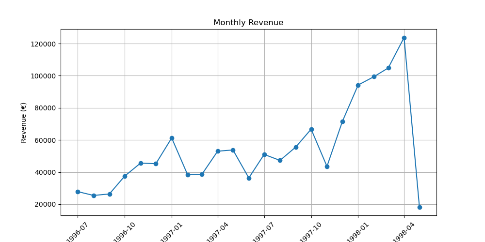
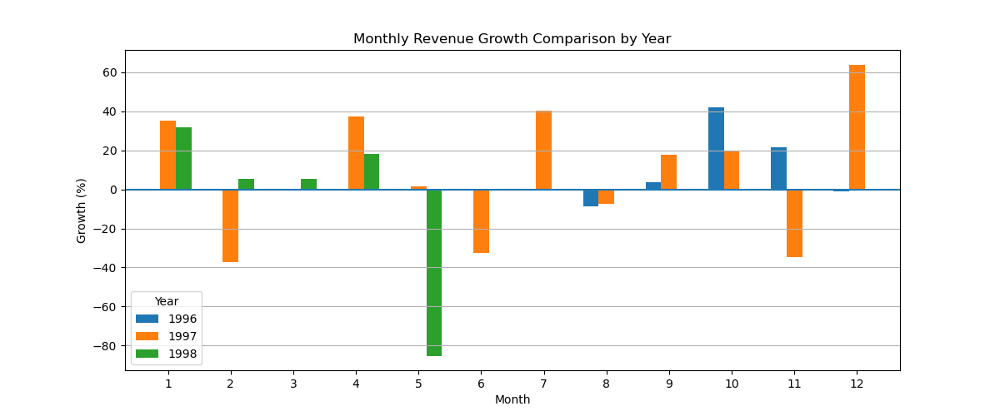
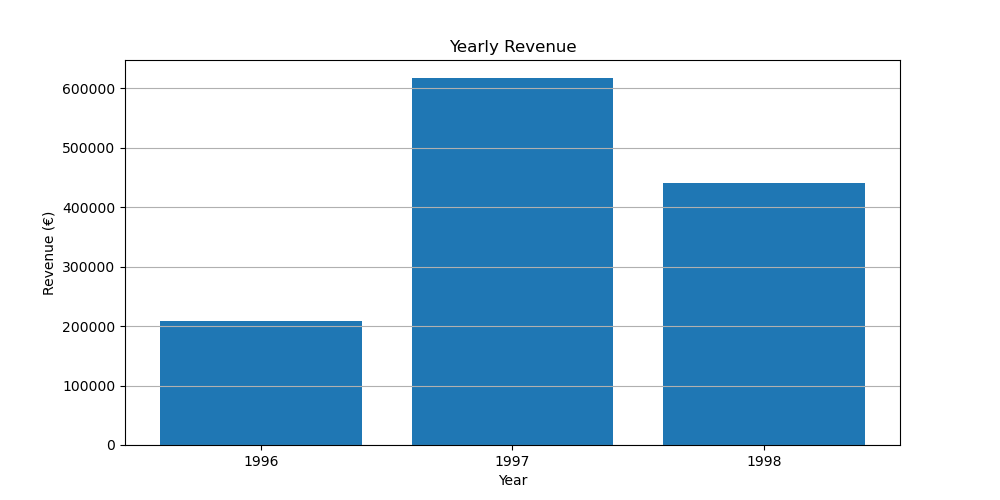
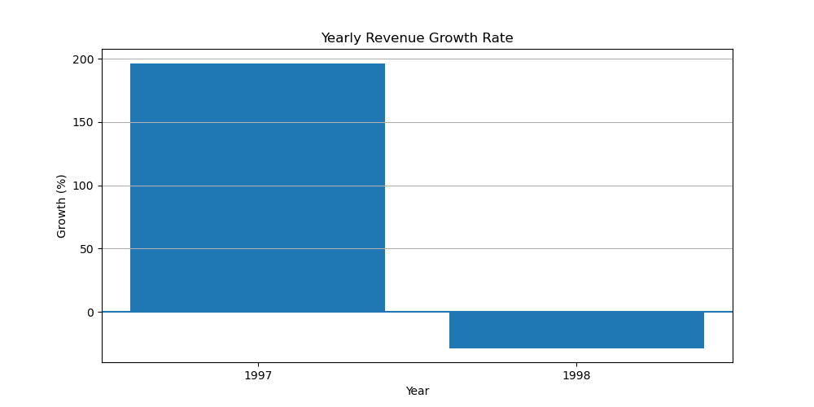

The **mart_monthly_growth** model aggregates sales data at the monthly level and calculates key performance indicators including monthly revenue and month-over-month revenue growth. It provides a business-ready dataset for analyzing short-term sales trends, identifying seasonal patterns, and supporting monthly performance reporting.

The **mart_yearly_growth** model aggregates sales data at the yearly level and calculates key performance indicators including yearly revenue and year-over-year revenue growth. It provides a business-ready dataset for evaluating long-term business performance, monitoring revenue development across years, and supporting strategic decision-making and executive reporting.

### KPI 1 – Monthly Revenue Development

This KPI shows Northwind’s monthly revenue development over time. It helps identify seasonal patterns, strong sales periods, and months with lower sales performance.

The analysis shows how revenue changes throughout the year and highlights whether certain months consistently generate higher sales than others.

This KPI can support sales forecasting, inventory planning, promotional activities, and seasonal business decisions.

### KPI 2 – Monthly Revenue Growth Rate

This KPI measures the month-over-month revenue growth rate. It shows whether Northwind’s revenue is increasing or decreasing compared to the previous month.

Positive growth values indicate increasing sales performance, while negative values highlight periods of declining revenue.

The analysis helps identify short-term business trends and sudden changes in customer demand.

This KPI can support campaign evaluation, operational planning, and early detection of declining sales trends.

### KPI 3 – Yearly Revenue Development

This KPI compares Northwind’s total revenue across different years. It provides an overview of the company’s long-term sales performance and overall business growth.

The analysis shows whether Northwind is expanding its revenue over time and identifies years with particularly strong or weak performance.

This KPI is useful for strategic planning, evaluating business development, and measuring long-term growth.

### KPI 4 – Yearly Revenue Growth Rate

This KPI measures the year-over-year revenue growth rate and shows how much Northwind’s revenue has changed compared to the previous year.

The analysis highlights periods of strong business growth as well as years with declining revenue performance.

By comparing yearly growth rates, Northwind can evaluate long-term trends and understand whether revenue growth is sustainable.

This KPI can support strategic decision-making, performance evaluation, and future business planning.

