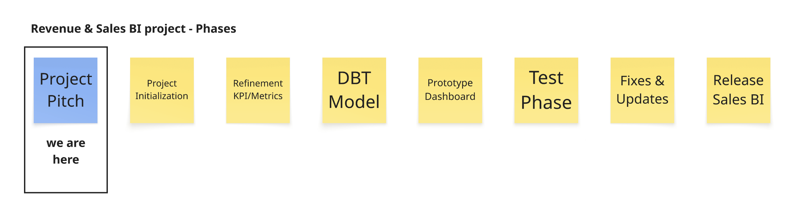
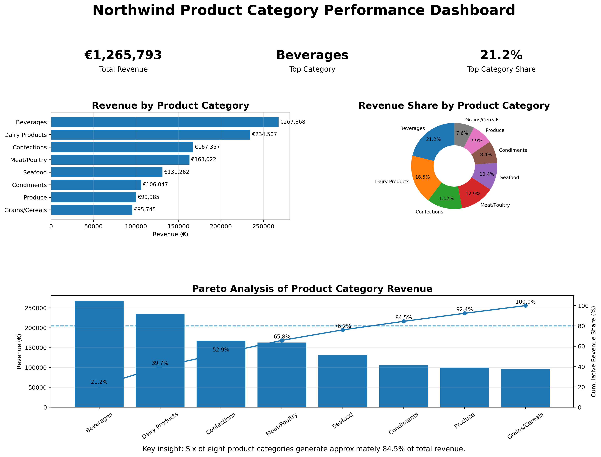

# Northwind Revenua & Sales BI project pitch

## What business problem do we want to solve?

The Northwind revenue and sales data is stored in multiple tables and locations and is not ready for immediate analysis or decision making based on this data.

We want to provide an actual and transparent data- and information foundation to support daily business decisions in a sustainable and understandable way.
We want to make sure, that everyone involved in decision making processes has the same information quantity and quality at hand at all times and that everyone understands what the information actually means.

**The outcome of this project would be a higher level of transparency on northwind´s actual business situation and decisions made on our insights.**

Therefore we suggest an approach with automation to minimize the daily struggles with finding, cleaning, analyzing and interpreting the data.

The project could be structured like this. We would expect that the first working prototype based on the concepts of this pitch could be available in about 2 weeks.

---

## Technical foundation: Which models did we build, and what does each do?

The project follows a typical layered dbt architecture:

### Staging Models

The staging models clean and standardize the raw Northwind data. They select only the required columns, rename them using a consistent naming convention (snake_case), and ensure that the data is ready for further processing.

- **staging_orders** – Cleans and standardizes the order information.
- **staging_order_details** – Cleans sales transaction data and keeps the relevant sales attributes.
- **staging_products** – Cleans and standardizes product information.
- **staging_categories** – Cleans category information for reporting.

### Prep Model

The **prep_sales** model combines all staging models into one unified sales dataset. It joins the tables, calculates the revenue for each sales record after discount, and creates additional reporting fields such as order year and order month.

### Mart Models

The **mart_sales_performance** model aggregates the prepared sales data by year, month, and product category. It calculates key performance indicators such as total revenue, number of orders, and average revenue, creating a business-ready dataset for reporting and dashboarding.

The **mart_monthly_growth** model aggregates sales data at the monthly level and calculates key performance indicators including monthly revenue and month-over-month revenue growth. It provides a business-ready dataset for analyzing short-term sales trends, identifying seasonal patterns, and supporting monthly performance reporting.

The **mart_yearly_growth** model aggregates sales data at the yearly level and calculates key performance indicators including yearly revenue and year-over-year revenue growth. It provides a business-ready dataset for evaluating long-term business performance, monitoring revenue development across years, and supporting strategic decision-making and executive reporting.

The **mart_orders_snapshot_kpis** model aggregates the order data by amount, min/max/mean-value, amount of order-items, trends for amounts, values and amount of order-items. It is the basis for a dashboard that helps to understand if the shopping behaviour of the customers is adjusting on short- or long term.

---

## What insights can your mart provide to Northwind?

The mart_sales_performance provides a clear overview of sales performance across different product categories and time periods.

With this model, Northwind can:

- Track total revenue by product category.
- Monitor monthly sales trends over time.
- Compare the performance of different product categories.
- Analyze the number of orders for each category.
- Identify high-performing and low-performing categories.
- Use a single, consistent dataset for dashboards and business reporting.

These insights help support data-driven business decisions and make sales reporting more efficient.

## Category Performance Dashboard

To demonstrate the business value of the mart, we created a small performance dashboard based on three key performance indicators.

### KPI 1 – Revenue by Product Category

This KPI compares the total revenue generated by each product category. It identifies high- and low-performing categories and helps Northwind understand which parts of the product portfolio contribute most to sales.

The analysis shows that **Beverages** is the highest-performing category with approximately **€267,868** in revenue. It is followed by **Dairy Products** with approximately **€234,507**.

The lowest-performing categories are **Produce** and **Grains/Cereals**.

This KPI can support decisions regarding product portfolio management, marketing activities, inventory planning, and resource allocation.

### KPI 2 – Revenue Share by Product Category

This KPI shows the percentage contribution of each category to Northwind's total revenue.

**Beverages account for approximately 21.2% of total revenue**, while **Dairy Products contribute around 18.5%**. Together, the two strongest categories generate almost **40% of total revenue**.

Revenue share provides additional context because it shows not only the absolute revenue of a category, but also its relative importance within the complete product portfolio.

### KPI 3 – Pareto Analysis

The Pareto analysis examines whether a small number of product categories generate most of Northwind's revenue.

The classical 80/20 principle does not fully apply to the available data. Instead, **six out of eight categories generate approximately 84.5% of total revenue**.

This means that revenue is concentrated across several strong categories rather than depending on only one or two categories. Northwind therefore has a relatively diversified revenue structure, although the strongest categories still have a significant influence on overall performance.

### Dashboard Insights

The dashboard provides the following key insights:

- Total revenue across all categories is approximately **€1.27 million**.
- **Beverages** is the strongest category and contributes **21.2%** of total revenue.
- Beverages and Dairy Products together generate almost **40%** of total revenue.
- Six of the eight categories account for approximately **84.5%** of total revenue.
- Northwind's revenue is concentrated in several strong categories, but the company is not highly dependent on only one category.

Together, these KPIs demonstrate how the `mart_sales_performance` model can be used as a business-ready data source for dashboards, reporting, and data-driven decision-making.

### KPI 4 – Monthly Revenue Development

This KPI shows Northwind’s monthly revenue development over time. It helps identify seasonal patterns, strong sales periods, and months with lower sales performance.

The analysis shows how revenue changes throughout the year and highlights whether certain months consistently generate higher sales than others.

This KPI can support sales forecasting, inventory planning, promotional activities, and seasonal business decisions.

### KPI 5 – Monthly Revenue Growth Rate

This KPI measures the month-over-month revenue growth rate. It shows whether Northwind’s revenue is increasing or decreasing compared to the previous month.

Positive growth values indicate increasing sales performance, while negative values highlight periods of declining revenue.

The analysis helps identify short-term business trends and sudden changes in customer demand.

This KPI can support campaign evaluation, operational planning, and early detection of declining sales trends.

### KPI 6 – Yearly Revenue Development

This KPI compares Northwind’s total revenue across different years. It provides an overview of the company’s long-term sales performance and overall business growth.

The analysis shows whether Northwind is expanding its revenue over time and identifies years with particularly strong or weak performance.

This KPI is useful for strategic planning, evaluating business development, and measuring long-term growth.

### KPI 7 – Yearly Revenue Growth Rate

This KPI measures the year-over-year revenue growth rate and shows how much Northwind’s revenue has changed compared to the previous year.

The analysis highlights periods of strong business growth as well as years with declining revenue performance.

By comparing yearly growth rates, Northwind can evaluate long-term trends and understand whether revenue growth is sustainable.

This KPI can support strategic decision-making, performance evaluation, and future business planning.

### KPI 8 – Total number of orders in current year including trend (%) compared to the same period in the previous year

Total number of orders in 1998 including trend compared to the same period of the previous year indicates the overall sales performance regarding the amount of orders.
Combined with the comparison to the previous year it also generates insight on the general business trend.

This KPI can be used to determine on a high level, if the business development is stable/as expected or if anticipation and correction might be needed

### KPI 9 – Number of orders in current month including trend (%) compared to same period of the previous year

The number of orders in the current month including trend compared to the same period of the previous year indicates the overall sales performance regarding the amount of orders in a defined period (= month)
Combined with the comparison to the previous year it also generates insight on the general business trend.

This KPI can be used as basis for a monthly reporting and as an indicator for a high level analysis on short-termed influences on order-volume.

### KPI 10 – Total Min/max/mean order value in current year including trend (%) compared to the same period of the previous year

Total Min/Max/Mean order value per year indicates the shopping behaviour of the customers. Based on these figures can be understood, if and how the shopping behaviour is developing in the current business year.
Combined with the comparison to the previous year it also generates insight on the company business trend.

In combination with trend and the total order amounts this KPI is a good indicator to forecast the revenue expectation for the current year.

### KPI 11 – Min/max/mean order value in current month including trend (%) compared to the same period of the previous year

Total Min/Max/Mean order value per month indicates the shopping behaviour of the customers in the current month. Based on these figures can be understood, if and how the shopping behaviour is developing in the most recent period.
Combined with the trend regarding the same month of to the previous year it also generates insight on the company business trend.

This KPI can be used as basis for a monthly reporting and as an indicator for a high level analysis on short-termed influences on revenue.

### KPI 12 – Total Min/max/mean number of order-items in current year including trend (%) compared to the same period of the previous year

Total Min/Max/Mean number of order-items per year indicates the shopping behaviour of the customers. Based on these figures can be understood, if and how the shopping behaviour is developing in the current business year.
Combined with the comparison to the previous year it also generates insight on the company business trend.

In combination with trend and the total order amounts this KPI is a good indicator to forecast the revenue expectation for the current year.
It would make sense to combine this metric with the mean_order_item_value to understand/forecast the impact on the revenue.

### KPI 13 – Min/max/mean number of order-items in current month including trend (%) compared to the same period of the previous year

Min/Max/Mean number of order-items per month indicates the shopping behaviour of the customers in the current month. Based on these figures can be understood, if and how the shopping behaviour is developing in the most recent period.
Combined with the trend regarding the same month of to the previous year it also generates insight on the company business trend.

This KPI can be used as basis for a monthly reporting and as an indicator for a high level analysis on short-termed influences on revenue.
It would make sense to combine this metric with the mean_order_item_value to understand/forecast the impact on the revenue.

---

## What was your biggest learning moment in this project?

Our biggest learning moment was understanding the purpose of the different dbt layers and understanding their dependencies.
We learned that staging models are used to clean and standardize raw data, prep models apply business logic by joining and transforming the data, and mart models create aggregated datasets that are ready for reporting and business analysis.

When combined and applied in the right way, the automation through the dbt pipeline saves a lot of time for easy reportings. It gives easy access to highly aggregated data, which is standardized for internal use.
This helps to create a unified understanding of the figures and data which is presented and therefore helps to ensure better decision-making-processes.

And also the usage of DBT and that we can implement test runs with different testing models to ensure the quality of the data. (non null, unique values etc.)
